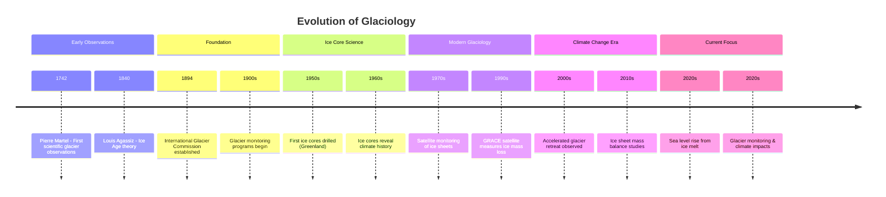

```mermaid
timeline
    title Evolution of Glaciology
    section Early Observations
        1742 : Pierre Martel - First scientific glacier observations
        1840 : Louis Agassiz - Ice Age theory
    section Foundation
        1894 : International Glacier Commission established
        1900s : Glacier monitoring programs begin
    section Ice Core Science
        1950s : First ice cores drilled (Greenland)
        1960s : Ice cores reveal climate history
    section Modern Glaciology
        1970s : Satellite monitoring of ice sheets
        1990s : GRACE satellite measures ice mass loss
    section Climate Change Era
        2000s : Accelerated glacier retreat observed
        2010s : Ice sheet mass balance studies
    section Current Focus
        2020s : Sea level rise from ice melt
        2020s : Glacier monitoring & climate impacts
```
