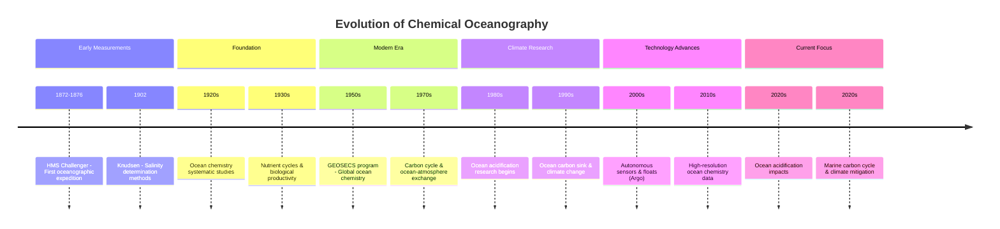

```mermaid
timeline
    title Evolution of Chemical Oceanography
    section Early Measurements
        1872-1876 : HMS Challenger - First oceanographic expedition
        1902 : Knudsen - Salinity determination methods
    section Foundation
        1920s : Ocean chemistry systematic studies
        1930s : Nutrient cycles & biological productivity
    section Modern Era
        1950s : GEOSECS program - Global ocean chemistry
        1970s : Carbon cycle & ocean-atmosphere exchange
    section Climate Research
        1980s : Ocean acidification research begins
        1990s : Ocean carbon sink & climate change
    section Technology Advances
        2000s : Autonomous sensors & floats (Argo)
        2010s : High-resolution ocean chemistry data
    section Current Focus
        2020s : Ocean acidification impacts
        2020s : Marine carbon cycle & climate mitigation
```
