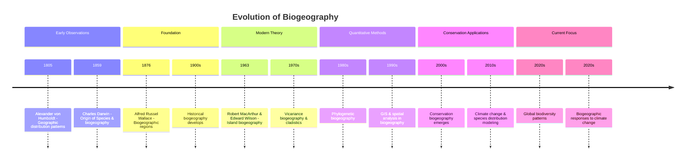

```mermaid
timeline
    title Evolution of Biogeography
    section Early Observations
        1805 : Alexander von Humboldt - Geographic distribution patterns
        1859 : Charles Darwin - Origin of Species & biogeography
    section Foundation
        1876 : Alfred Russel Wallace - Biogeographic regions
        1900s : Historical biogeography develops
    section Modern Theory
        1963 : Robert MacArthur & Edward Wilson - Island biogeography
        1970s : Vicariance biogeography & cladistics
    section Quantitative Methods
        1980s : Phylogenetic biogeography
        1990s : GIS & spatial analysis in biogeography
    section Conservation Applications
        2000s : Conservation biogeography emerges
        2010s : Climate change & species distribution modeling
    section Current Focus
        2020s : Global biodiversity patterns
        2020s : Biogeographic responses to climate change
```
