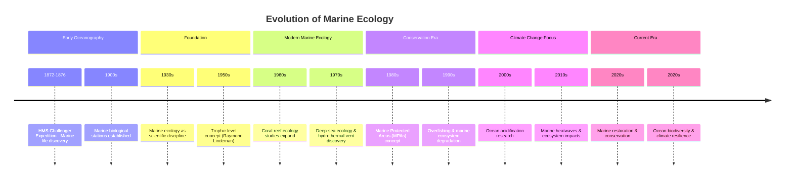

```mermaid
timeline
    title Evolution of Marine Ecology
    section Early Oceanography
        1872-1876 : HMS Challenger Expedition - Marine life discovery
        1900s : Marine biological stations established
    section Foundation
        1930s : Marine ecology as scientific discipline
        1950s : Trophic level concept (Raymond Lindeman)
    section Modern Marine Ecology
        1960s : Coral reef ecology studies expand
        1970s : Deep-sea ecology & hydrothermal vent discovery
    section Conservation Era
        1980s : Marine Protected Areas (MPAs) concept
        1990s : Overfishing & marine ecosystem degradation
    section Climate Change Focus
        2000s : Ocean acidification research
        2010s : Marine heatwaves & ecosystem impacts
    section Current Era
        2020s : Marine restoration & conservation
        2020s : Ocean biodiversity & climate resilience
```
