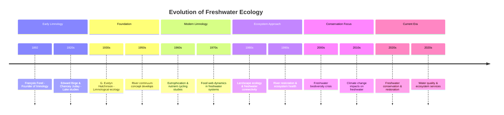

```mermaid
timeline
    title Evolution of Freshwater Ecology
    section Early Limnology
        1892 : François Forel - Founder of limnology
        1920s : Edward Birge & Chancey Juday - Lake studies
    section Foundation
        1930s : G. Evelyn Hutchinson - Limnological ecology
        1950s : River continuum concept develops
    section Modern Limnology
        1960s : Eutrophication & nutrient cycling studies
        1970s : Food web dynamics in freshwater systems
    section Ecosystem Approach
        1980s : Landscape ecology & freshwater connectivity
        1990s : River restoration & ecosystem health
    section Conservation Focus
        2000s : Freshwater biodiversity crisis
        2010s : Climate change impacts on freshwater
    section Current Era
        2020s : Freshwater conservation & restoration
        2020s : Water quality & ecosystem services
```
