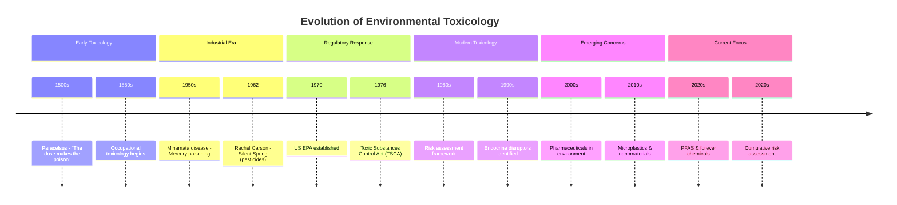

```mermaid
timeline
    title Evolution of Environmental Toxicology
    section Early Toxicology
        1500s : Paracelsus - "The dose makes the poison"
        1850s : Occupational toxicology begins
    section Industrial Era
        1950s : Minamata disease - Mercury poisoning
        1962 : Rachel Carson - Silent Spring (pesticides)
    section Regulatory Response
        1970 : US EPA established
        1976 : Toxic Substances Control Act (TSCA)
    section Modern Toxicology
        1980s : Risk assessment framework
        1990s : Endocrine disruptors identified
    section Emerging Concerns
        2000s : Pharmaceuticals in environment
        2010s : Microplastics & nanomaterials
    section Current Focus
        2020s : PFAS & forever chemicals
        2020s : Cumulative risk assessment
```
