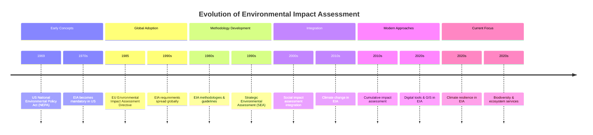

```mermaid
timeline
    title Evolution of Environmental Impact Assessment
    section Early Concepts
        1969 : US National Environmental Policy Act (NEPA)
        1970s : EIA becomes mandatory in US
    section Global Adoption
        1985 : EU Environmental Impact Assessment Directive
        1990s : EIA requirements spread globally
    section Methodology Development
        1980s : EIA methodologies & guidelines
        1990s : Strategic Environmental Assessment (SEA)
    section Integration
        2000s : Social impact assessment integration
        2010s : Climate change in EIA
    section Modern Approaches
        2010s : Cumulative impact assessment
        2020s : Digital tools & GIS in EIA
    section Current Focus
        2020s : Climate resilience in EIA
        2020s : Biodiversity & ecosystem services
```
