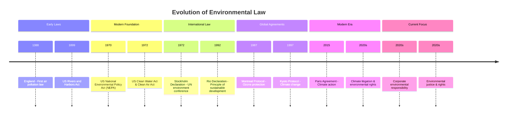

```mermaid
timeline
    title Evolution of Environmental Law
    section Early Laws
        1388 : England - First air pollution law
        1899 : US Rivers and Harbors Act
    section Modern Foundation
        1970 : US National Environmental Policy Act (NEPA)
        1972 : US Clean Water Act & Clean Air Act
    section International Law
        1972 : Stockholm Declaration - UN environment conference
        1992 : Rio Declaration - Principle of sustainable development
    section Global Agreements
        1987 : Montreal Protocol - Ozone protection
        1997 : Kyoto Protocol - Climate change
    section Modern Era
        2015 : Paris Agreement - Climate action
        2020s : Climate litigation & environmental rights
    section Current Focus
        2020s : Corporate environmental responsibility
        2020s : Environmental justice & rights
```
