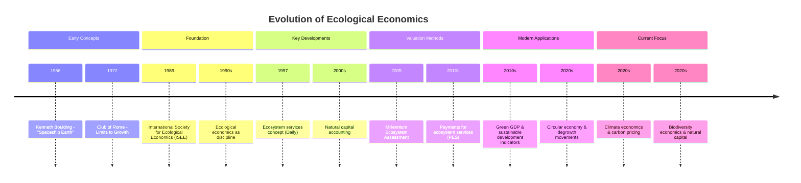

```mermaid
timeline
    title Evolution of Ecological Economics
    section Early Concepts
        1966 : Kenneth Boulding - "Spaceship Earth"
        1972 : Club of Rome - Limits to Growth
    section Foundation
        1989 : International Society for Ecological Economics (ISEE)
        1990s : Ecological economics as discipline
    section Key Developments
        1997 : Ecosystem services concept (Daily)
        2000s : Natural capital accounting
    section Valuation Methods
        2005 : Millennium Ecosystem Assessment
        2010s : Payments for ecosystem services (PES)
    section Modern Applications
        2010s : Green GDP & sustainable development indicators
        2020s : Circular economy & degrowth movements
    section Current Focus
        2020s : Climate economics & carbon pricing
        2020s : Biodiversity economics & natural capital
```
