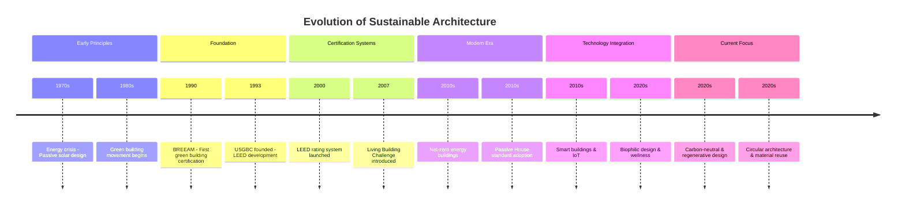

```mermaid
timeline
    title Evolution of Sustainable Architecture
    section Early Principles
        1970s : Energy crisis - Passive solar design
        1980s : Green building movement begins
    section Foundation
        1990 : BREEAM - First green building certification
        1993 : USGBC founded - LEED development
    section Certification Systems
        2000 : LEED rating system launched
        2007 : Living Building Challenge introduced
    section Modern Era
        2010s : Net-zero energy buildings
        2010s : Passive House standard adoption
    section Technology Integration
        2010s : Smart buildings & IoT
        2020s : Biophilic design & wellness
    section Current Focus
        2020s : Carbon-neutral & regenerative design
        2020s : Circular architecture & material reuse
```
