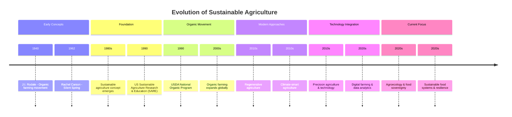

```mermaid
timeline
    title Evolution of Sustainable Agriculture
    section Early Concepts
        1940 : J.I. Rodale - Organic farming movement
        1962 : Rachel Carson - Silent Spring
    section Foundation
        1980s : Sustainable agriculture concept emerges
        1990 : US Sustainable Agriculture Research & Education (SARE)
    section Organic Movement
        1990 : USDA National Organic Program
        2000s : Organic farming expands globally
    section Modern Approaches
        2010s : Regenerative agriculture
        2010s : Climate-smart agriculture
    section Technology Integration
        2010s : Precision agriculture & technology
        2020s : Digital farming & data analytics
    section Current Focus
        2020s : Agroecology & food sovereignty
        2020s : Sustainable food systems & resilience
```
