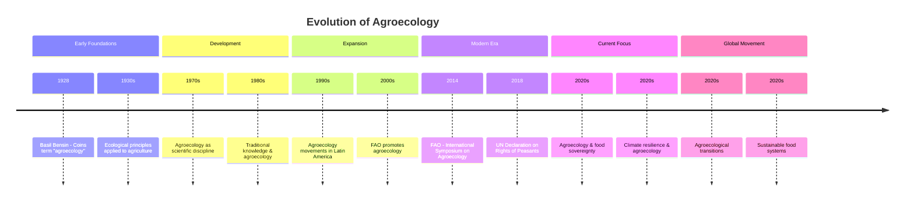

```mermaid
timeline
    title Evolution of Agroecology
    section Early Foundations
        1928 : Basil Bensin - Coins term "agroecology"
        1930s : Ecological principles applied to agriculture
    section Development
        1970s : Agroecology as scientific discipline
        1980s : Traditional knowledge & agroecology
    section Expansion
        1990s : Agroecology movements in Latin America
        2000s : FAO promotes agroecology
    section Modern Era
        2014 : FAO - International Symposium on Agroecology
        2018 : UN Declaration on Rights of Peasants
    section Current Focus
        2020s : Agroecology & food sovereignty
        2020s : Climate resilience & agroecology
    section Global Movement
        2020s : Agroecological transitions
        2020s : Sustainable food systems
```
