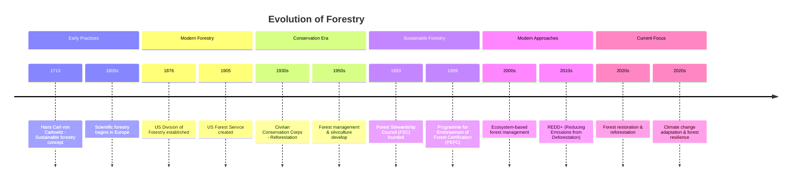

```mermaid
timeline
    title Evolution of Forestry
    section Early Practices
        1713 : Hans Carl von Carlowitz - Sustainable forestry concept
        1800s : Scientific forestry begins in Europe
    section Modern Forestry
        1876 : US Division of Forestry established
        1905 : US Forest Service created
    section Conservation Era
        1930s : Civilian Conservation Corps - Reforestation
        1950s : Forest management & silviculture develop
    section Sustainable Forestry
        1993 : Forest Stewardship Council (FSC) founded
        1999 : Programme for Endorsement of Forest Certification (PEFC)
    section Modern Approaches
        2000s : Ecosystem-based forest management
        2010s : REDD+ (Reducing Emissions from Deforestation)
    section Current Focus
        2020s : Forest restoration & reforestation
        2020s : Climate change adaptation & forest resilience
```
