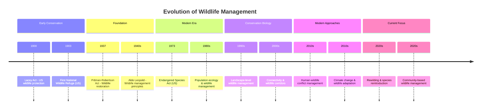

```mermaid
timeline
    title Evolution of Wildlife Management
    section Early Conservation
        1900 : Lacey Act - US wildlife protection
        1903 : First National Wildlife Refuge (US)
    section Foundation
        1937 : Pittman-Robertson Act - Wildlife restoration
        1940s : Aldo Leopold - Wildlife management principles
    section Modern Era
        1973 : Endangered Species Act (US)
        1980s : Population ecology & wildlife management
    section Conservation Biology
        1990s : Landscape-level wildlife management
        2000s : Connectivity & wildlife corridors
    section Modern Approaches
        2010s : Human-wildlife conflict management
        2010s : Climate change & wildlife adaptation
    section Current Focus
        2020s : Rewilding & species reintroduction
        2020s : Community-based wildlife management
```
