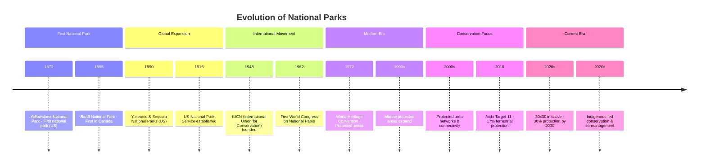

```mermaid
timeline
    title Evolution of National Parks
    section First National Park
        1872 : Yellowstone National Park - First national park (US)
        1885 : Banff National Park - First in Canada
    section Global Expansion
        1890 : Yosemite & Sequoia National Parks (US)
        1916 : US National Park Service established
    section International Movement
        1948 : IUCN (International Union for Conservation) founded
        1962 : First World Congress on National Parks
    section Modern Era
        1972 : World Heritage Convention - Protected areas
        1990s : Marine protected areas expand
    section Conservation Focus
        2000s : Protected area networks & connectivity
        2010 : Aichi Target 11 - 17% terrestrial protection
    section Current Era
        2020s : 30x30 initiative - 30% protection by 2030
        2020s : Indigenous-led conservation & co-management
```
