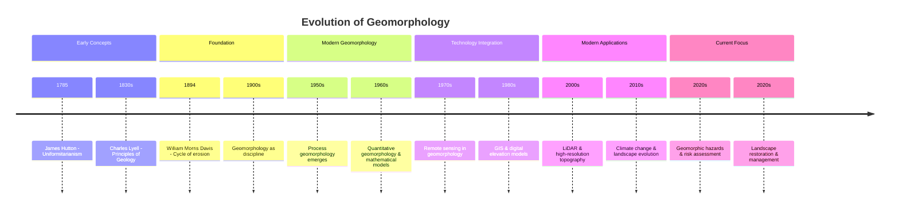

```mermaid
timeline
    title Evolution of Geomorphology
    section Early Concepts
        1785 : James Hutton - Uniformitarianism
        1830s : Charles Lyell - Principles of Geology
    section Foundation
        1894 : William Morris Davis - Cycle of erosion
        1900s : Geomorphology as discipline
    section Modern Geomorphology
        1950s : Process geomorphology emerges
        1960s : Quantitative geomorphology & mathematical models
    section Technology Integration
        1970s : Remote sensing in geomorphology
        1980s : GIS & digital elevation models
    section Modern Applications
        2000s : LiDAR & high-resolution topography
        2010s : Climate change & landscape evolution
    section Current Focus
        2020s : Geomorphic hazards & risk assessment
        2020s : Landscape restoration & management
```
