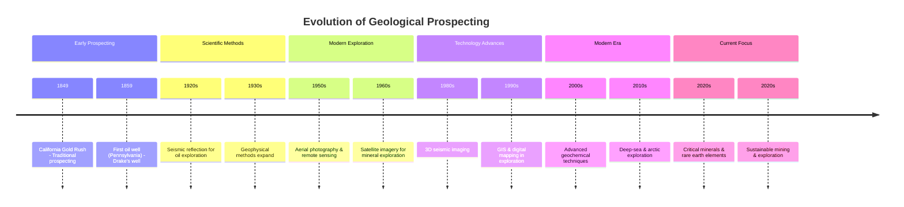

```mermaid
timeline
    title Evolution of Geological Prospecting
    section Early Prospecting
        1849 : California Gold Rush - Traditional prospecting
        1859 : First oil well (Pennsylvania) - Drake's well
    section Scientific Methods
        1920s : Seismic reflection for oil exploration
        1930s : Geophysical methods expand
    section Modern Exploration
        1950s : Aerial photography & remote sensing
        1960s : Satellite imagery for mineral exploration
    section Technology Advances
        1980s : 3D seismic imaging
        1990s : GIS & digital mapping in exploration
    section Modern Era
        2000s : Advanced geochemical techniques
        2010s : Deep-sea & arctic exploration
    section Current Focus
        2020s : Critical minerals & rare earth elements
        2020s : Sustainable mining & exploration
```
