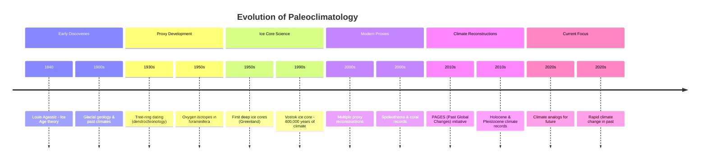

```mermaid
timeline
    title Evolution of Paleoclimatology
    section Early Discoveries
        1840 : Louis Agassiz - Ice Age theory
        1900s : Glacial geology & past climates
    section Proxy Development
        1930s : Tree-ring dating (dendrochronology)
        1950s : Oxygen isotopes in foraminifera
    section Ice Core Science
        1950s : First deep ice cores (Greenland)
        1990s : Vostok ice core - 400,000 years of climate
    section Modern Proxies
        2000s : Multiple proxy reconstructions
        2000s : Speleothems & coral records
    section Climate Reconstructions
        2010s : PAGES (Past Global Changes) initiative
        2010s : Holocene & Pleistocene climate records
    section Current Focus
        2020s : Climate analogs for future
        2020s : Rapid climate change in past
```
