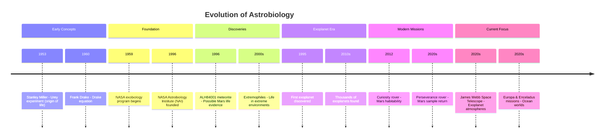

```mermaid
timeline
    title Evolution of Astrobiology
    section Early Concepts
        1953 : Stanley Miller - Urey experiment (origin of life)
        1960 : Frank Drake - Drake equation
    section Foundation
        1959 : NASA exobiology program begins
        1996 : NASA Astrobiology Institute (NAI) founded
    section Discoveries
        1996 : ALH84001 meteorite - Possible Mars life evidence
        2000s : Extremophiles - Life in extreme environments
    section Exoplanet Era
        1995 : First exoplanet discovered
        2010s : Thousands of exoplanets found
    section Modern Missions
        2012 : Curiosity rover - Mars habitability
        2020s : Perseverance rover - Mars sample return
    section Current Focus
        2020s : James Webb Space Telescope - Exoplanet atmospheres
        2020s : Europa & Enceladus missions - Ocean worlds
```
