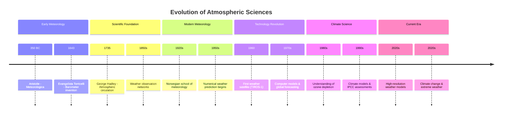

```mermaid
timeline
    title Evolution of Atmospheric Sciences
    section Early Meteorology
        350 BC : Aristotle - Meteorologica
        1643 : Evangelista Torricelli - Barometer invention
    section Scientific Foundation
        1735 : George Hadley - Atmospheric circulation
        1850s : Weather observation networks
    section Modern Meteorology
        1920s : Norwegian school of meteorology
        1950s : Numerical weather prediction begins
    section Technology Revolution
        1960 : First weather satellite (TIROS-1)
        1970s : Computer models & global forecasting
    section Climate Science
        1980s : Understanding of ozone depletion
        1990s : Climate models & IPCC assessments
    section Current Era
        2020s : High-resolution weather models
        2020s : Climate change & extreme weather
```
