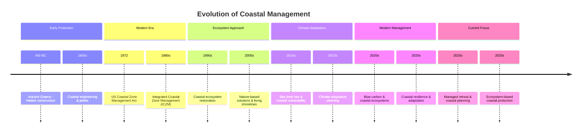

```mermaid
timeline
    title Evolution of Coastal Management
    section Early Protection
        400 BC : Ancient Greece - Harbor construction
        1800s : Coastal engineering & jetties
    section Modern Era
        1972 : US Coastal Zone Management Act
        1980s : Integrated Coastal Zone Management (ICZM)
    section Ecosystem Approach
        1990s : Coastal ecosystem restoration
        2000s : Nature-based solutions & living shorelines
    section Climate Adaptation
        2010s : Sea level rise & coastal vulnerability
        2010s : Climate adaptation planning
    section Modern Management
        2020s : Blue carbon & coastal ecosystems
        2020s : Coastal resilience & adaptation
    section Current Focus
        2020s : Managed retreat & coastal planning
        2020s : Ecosystem-based coastal protection
```
