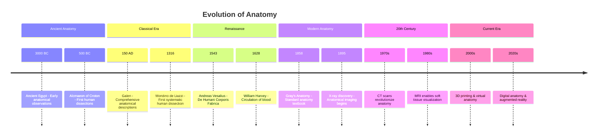

```mermaid
timeline
    title Evolution of Anatomy
    section Ancient Anatomy
        3000 BC : Ancient Egypt - Early anatomical observations
        500 BC : Alcmaeon of Croton - First human dissections
    section Classical Era
        150 AD : Galen - Comprehensive anatomical descriptions
        1316 : Mondino de Liuzzi - First systematic human dissection
    section Renaissance
        1543 : Andreas Vesalius - De Humani Corporis Fabrica
        1628 : William Harvey - Circulation of blood
    section Modern Anatomy
        1858 : Gray's Anatomy - Standard anatomy textbook
        1895 : X-ray discovery - Anatomical imaging begins
    section 20th Century
        1970s : CT scans revolutionize anatomy
        1980s : MRI enables soft tissue visualization
    section Current Era
        2000s : 3D printing & virtual anatomy
        2020s : Digital anatomy & augmented reality
```
