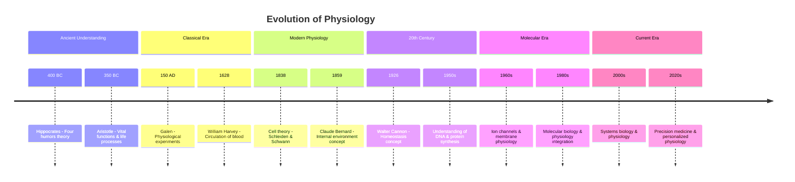

```mermaid
timeline
    title Evolution of Physiology
    section Ancient Understanding
        400 BC : Hippocrates - Four humors theory
        350 BC : Aristotle - Vital functions & life processes
    section Classical Era
        150 AD : Galen - Physiological experiments
        1628 : William Harvey - Circulation of blood
    section Modern Physiology
        1838 : Cell theory - Schleiden & Schwann
        1859 : Claude Bernard - Internal environment concept
    section 20th Century
        1926 : Walter Cannon - Homeostasis concept
        1950s : Understanding of DNA & protein synthesis
    section Molecular Era
        1960s : Ion channels & membrane physiology
        1980s : Molecular biology & physiology integration
    section Current Era
        2000s : Systems biology & physiology
        2020s : Precision medicine & personalized physiology
```
