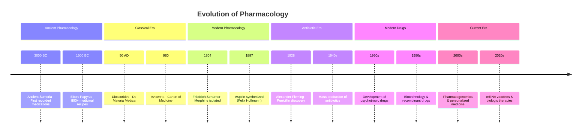

```mermaid
timeline
    title Evolution of Pharmacology
    section Ancient Pharmacology
        3000 BC : Ancient Sumeria - First recorded medications
        1500 BC : Ebers Papyrus - 800+ medicinal recipes
    section Classical Era
        50 AD : Dioscorides - De Materia Medica
        980 : Avicenna - Canon of Medicine
    section Modern Pharmacology
        1804 : Friedrich Sertürner - Morphine isolated
        1897 : Aspirin synthesized (Felix Hoffmann)
    section Antibiotic Era
        1928 : Alexander Fleming - Penicillin discovery
        1940s : Mass production of antibiotics
    section Modern Drugs
        1950s : Development of psychotropic drugs
        1980s : Biotechnology & recombinant drugs
    section Current Era
        2000s : Pharmacogenomics & personalized medicine
        2020s : mRNA vaccines & biologic therapies
```
