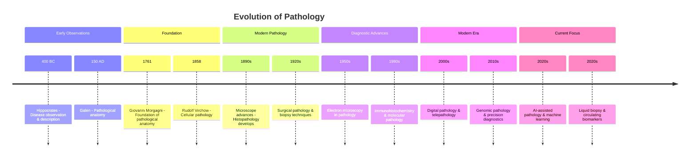

```mermaid
timeline
    title Evolution of Pathology
    section Early Observations
        400 BC : Hippocrates - Disease observation & description
        150 AD : Galen - Pathological anatomy
    section Foundation
        1761 : Giovanni Morgagni - Foundation of pathological anatomy
        1858 : Rudolf Virchow - Cellular pathology
    section Modern Pathology
        1890s : Microscope advances - Histopathology develops
        1920s : Surgical pathology & biopsy techniques
    section Diagnostic Advances
        1950s : Electron microscopy in pathology
        1980s : Immunohistochemistry & molecular pathology
    section Modern Era
        2000s : Digital pathology & telepathology
        2010s : Genomic pathology & precision diagnostics
    section Current Focus
        2020s : AI-assisted pathology & machine learning
        2020s : Liquid biopsy & circulating biomarkers
```
