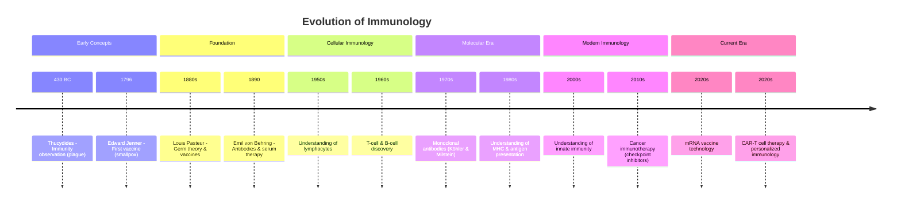

```mermaid
timeline
    title Evolution of Immunology
    section Early Concepts
        430 BC : Thucydides - Immunity observation (plague)
        1796 : Edward Jenner - First vaccine (smallpox)
    section Foundation
        1880s : Louis Pasteur - Germ theory & vaccines
        1890 : Emil von Behring - Antibodies & serum therapy
    section Cellular Immunology
        1950s : Understanding of lymphocytes
        1960s : T-cell & B-cell discovery
    section Molecular Era
        1970s : Monoclonal antibodies (Köhler & Milstein)
        1980s : Understanding of MHC & antigen presentation
    section Modern Immunology
        2000s : Understanding of innate immunity
        2010s : Cancer immunotherapy (checkpoint inhibitors)
    section Current Era
        2020s : mRNA vaccine technology
        2020s : CAR-T cell therapy & personalized immunology
```
