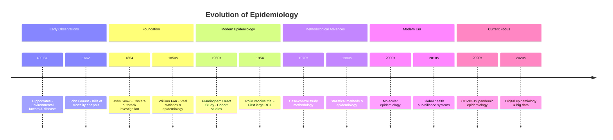

```mermaid
timeline
    title Evolution of Epidemiology
    section Early Observations
        400 BC : Hippocrates - Environmental factors & disease
        1662 : John Graunt - Bills of Mortality analysis
    section Foundation
        1854 : John Snow - Cholera outbreak investigation
        1850s : William Farr - Vital statistics & epidemiology
    section Modern Epidemiology
        1950s : Framingham Heart Study - Cohort studies
        1954 : Polio vaccine trial - First large RCT
    section Methodological Advances
        1970s : Case-control study methodology
        1980s : Statistical methods & epidemiology
    section Modern Era
        2000s : Molecular epidemiology
        2010s : Global health surveillance systems
    section Current Focus
        2020s : COVID-19 pandemic epidemiology
        2020s : Digital epidemiology & big data
```
