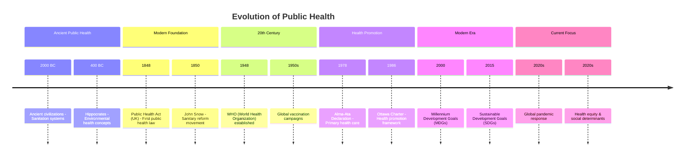

```mermaid
timeline
    title Evolution of Public Health
    section Ancient Public Health
        2000 BC : Ancient civilizations - Sanitation systems
        400 BC : Hippocrates - Environmental health concepts
    section Modern Foundation
        1848 : Public Health Act (UK) - First public health law
        1850 : John Snow - Sanitary reform movement
    section 20th Century
        1948 : WHO (World Health Organization) established
        1950s : Global vaccination campaigns
    section Health Promotion
        1978 : Alma-Ata Declaration - Primary health care
        1986 : Ottawa Charter - Health promotion framework
    section Modern Era
        2000 : Millennium Development Goals (MDGs)
        2015 : Sustainable Development Goals (SDGs)
    section Current Focus
        2020s : Global pandemic response
        2020s : Health equity & social determinants
```
