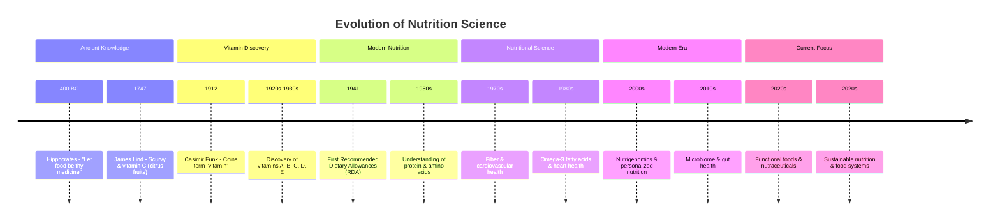

```mermaid
timeline
    title Evolution of Nutrition Science
    section Ancient Knowledge
        400 BC : Hippocrates - "Let food be thy medicine"
        1747 : James Lind - Scurvy & vitamin C (citrus fruits)
    section Vitamin Discovery
        1912 : Casimir Funk - Coins term "vitamin"
        1920s-1930s : Discovery of vitamins A, B, C, D, E
    section Modern Nutrition
        1941 : First Recommended Dietary Allowances (RDA)
        1950s : Understanding of protein & amino acids
    section Nutritional Science
        1970s : Fiber & cardiovascular health
        1980s : Omega-3 fatty acids & heart health
    section Modern Era
        2000s : Nutrigenomics & personalized nutrition
        2010s : Microbiome & gut health
    section Current Focus
        2020s : Functional foods & nutraceuticals
        2020s : Sustainable nutrition & food systems
```
