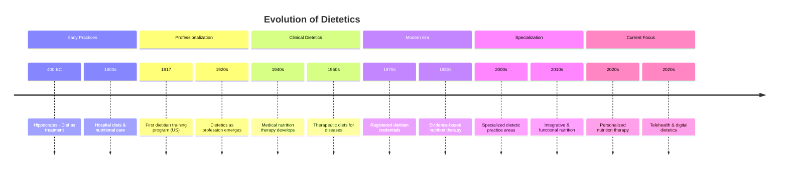

```mermaid
timeline
    title Evolution of Dietetics
    section Early Practices
        400 BC : Hippocrates - Diet as treatment
        1800s : Hospital diets & nutritional care
    section Professionalization
        1917 : First dietitian training program (US)
        1920s : Dietetics as profession emerges
    section Clinical Dietetics
        1940s : Medical nutrition therapy develops
        1950s : Therapeutic diets for diseases
    section Modern Era
        1970s : Registered dietitian credentials
        1980s : Evidence-based nutrition therapy
    section Specialization
        2000s : Specialized dietetic practice areas
        2010s : Integrative & functional nutrition
    section Current Focus
        2020s : Personalized nutrition therapy
        2020s : Telehealth & digital dietetics
```
