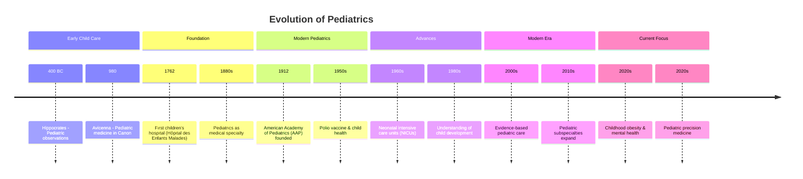

```mermaid
timeline
    title Evolution of Pediatrics
    section Early Child Care
        400 BC : Hippocrates - Pediatric observations
        980 : Avicenna - Pediatric medicine in Canon
    section Foundation
        1762 : First children's hospital (Hôpital des Enfants Malades)
        1880s : Pediatrics as medical specialty
    section Modern Pediatrics
        1912 : American Academy of Pediatrics (AAP) founded
        1950s : Polio vaccine & child health
    section Advances
        1960s : Neonatal intensive care units (NICUs)
        1980s : Understanding of child development
    section Modern Era
        2000s : Evidence-based pediatric care
        2010s : Pediatric subspecialties expand
    section Current Focus
        2020s : Childhood obesity & mental health
        2020s : Pediatric precision medicine
```
