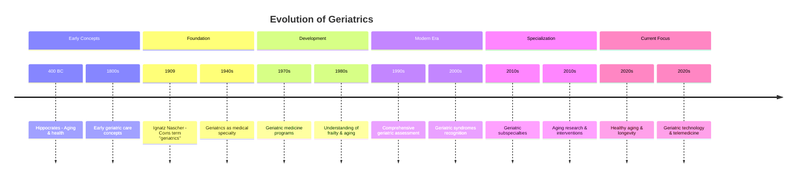

```mermaid
timeline
    title Evolution of Geriatrics
    section Early Concepts
        400 BC : Hippocrates - Aging & health
        1800s : Early geriatric care concepts
    section Foundation
        1909 : Ignatz Nascher - Coins term "geriatrics"
        1940s : Geriatrics as medical specialty
    section Development
        1970s : Geriatric medicine programs
        1980s : Understanding of frailty & aging
    section Modern Era
        1990s : Comprehensive geriatric assessment
        2000s : Geriatric syndromes recognition
    section Specialization
        2010s : Geriatric subspecialties
        2010s : Aging research & interventions
    section Current Focus
        2020s : Healthy aging & longevity
        2020s : Geriatric technology & telemedicine
```
