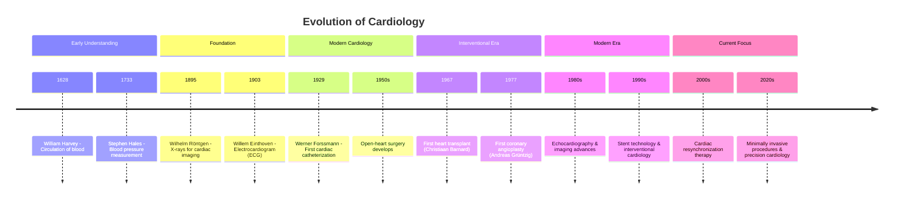

```mermaid
timeline
    title Evolution of Cardiology
    section Early Understanding
        1628 : William Harvey - Circulation of blood
        1733 : Stephen Hales - Blood pressure measurement
    section Foundation
        1895 : Wilhelm Röntgen - X-rays for cardiac imaging
        1903 : Willem Einthoven - Electrocardiogram (ECG)
    section Modern Cardiology
        1929 : Werner Forssmann - First cardiac catheterization
        1950s : Open-heart surgery develops
    section Interventional Era
        1967 : First heart transplant (Christiaan Barnard)
        1977 : First coronary angioplasty (Andreas Grüntzig)
    section Modern Era
        1980s : Echocardiography & imaging advances
        1990s : Stent technology & interventional cardiology
    section Current Focus
        2000s : Cardiac resynchronization therapy
        2020s : Minimally invasive procedures & precision cardiology
```
