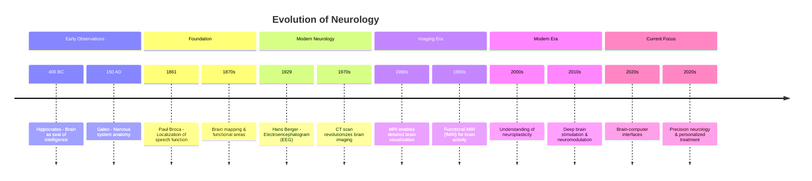

```mermaid
timeline
    title Evolution of Neurology
    section Early Observations
        400 BC : Hippocrates - Brain as seat of intelligence
        150 AD : Galen - Nervous system anatomy
    section Foundation
        1861 : Paul Broca - Localization of speech function
        1870s : Brain mapping & functional areas
    section Modern Neurology
        1929 : Hans Berger - Electroencephalogram (EEG)
        1970s : CT scan revolutionizes brain imaging
    section Imaging Era
        1980s : MRI enables detailed brain visualization
        1990s : Functional MRI (fMRI) for brain activity
    section Modern Era
        2000s : Understanding of neuroplasticity
        2010s : Deep brain stimulation & neuromodulation
    section Current Focus
        2020s : Brain-computer interfaces
        2020s : Precision neurology & personalized treatment
```
