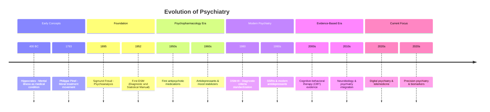

```mermaid
timeline
    title Evolution of Psychiatry
    section Early Concepts
        400 BC : Hippocrates - Mental illness as medical condition
        1793 : Philippe Pinel - Moral treatment movement
    section Foundation
        1895 : Sigmund Freud - Psychoanalysis
        1952 : First DSM (Diagnostic and Statistical Manual)
    section Psychopharmacology Era
        1950s : First antipsychotic medications
        1960s : Antidepressants & mood stabilizers
    section Modern Psychiatry
        1980 : DSM-III - Diagnostic criteria standardization
        1990s : SSRIs & modern antidepressants
    section Evidence-Based Era
        2000s : Cognitive-behavioral therapy (CBT) evidence
        2010s : Neurobiology & psychiatry integration
    section Current Focus
        2020s : Digital psychiatry & telemedicine
        2020s : Precision psychiatry & biomarkers
```
