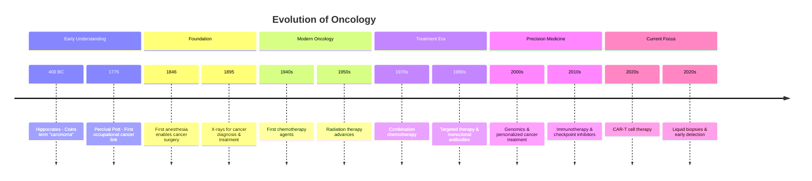

```mermaid
timeline
    title Evolution of Oncology
    section Early Understanding
        400 BC : Hippocrates - Coins term "carcinoma"
        1775 : Percival Pott - First occupational cancer link
    section Foundation
        1846 : First anesthesia enables cancer surgery
        1895 : X-rays for cancer diagnosis & treatment
    section Modern Oncology
        1940s : First chemotherapy agents
        1950s : Radiation therapy advances
    section Treatment Era
        1970s : Combination chemotherapy
        1990s : Targeted therapy & monoclonal antibodies
    section Precision Medicine
        2000s : Genomics & personalized cancer treatment
        2010s : Immunotherapy & checkpoint inhibitors
    section Current Focus
        2020s : CAR-T cell therapy
        2020s : Liquid biopsies & early detection
```
