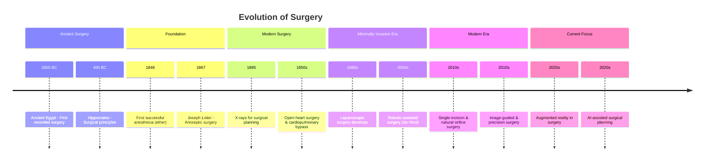

```mermaid
timeline
    title Evolution of Surgery
    section Ancient Surgery
        2600 BC : Ancient Egypt - First recorded surgery
        400 BC : Hippocrates - Surgical principles
    section Foundation
        1846 : First successful anesthesia (ether)
        1867 : Joseph Lister - Antiseptic surgery
    section Modern Surgery
        1895 : X-rays for surgical planning
        1950s : Open-heart surgery & cardiopulmonary bypass
    section Minimally Invasive Era
        1980s : Laparoscopic surgery develops
        2000s : Robotic-assisted surgery (da Vinci)
    section Modern Era
        2010s : Single-incision & natural orifice surgery
        2010s : Image-guided & precision surgery
    section Current Focus
        2020s : Augmented reality in surgery
        2020s : AI-assisted surgical planning
```
