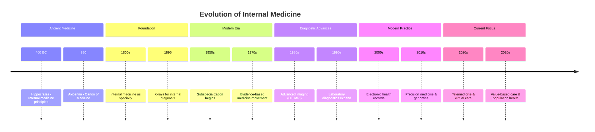

```mermaid
timeline
    title Evolution of Internal Medicine
    section Ancient Medicine
        400 BC : Hippocrates - Internal medicine principles
        980 : Avicenna - Canon of Medicine
    section Foundation
        1800s : Internal medicine as specialty
        1895 : X-rays for internal diagnosis
    section Modern Era
        1950s : Subspecialization begins
        1970s : Evidence-based medicine movement
    section Diagnostic Advances
        1980s : Advanced imaging (CT, MRI)
        1990s : Laboratory diagnostics expand
    section Modern Practice
        2000s : Electronic health records
        2010s : Precision medicine & genomics
    section Current Focus
        2020s : Telemedicine & virtual care
        2020s : Value-based care & population health
```
