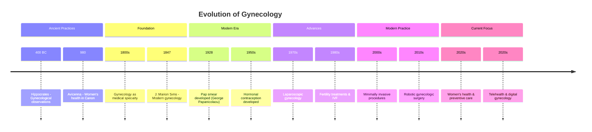

```mermaid
timeline
    title Evolution of Gynecology
    section Ancient Practices
        400 BC : Hippocrates - Gynecological observations
        980 : Avicenna - Women's health in Canon
    section Foundation
        1800s : Gynecology as medical specialty
        1847 : J. Marion Sims - Modern gynecology
    section Modern Era
        1928 : Pap smear developed (George Papanicolaou)
        1950s : Hormonal contraception developed
    section Advances
        1970s : Laparoscopic gynecology
        1980s : Fertility treatments & IVF
    section Modern Practice
        2000s : Minimally invasive procedures
        2010s : Robotic gynecologic surgery
    section Current Focus
        2020s : Women's health & preventive care
        2020s : Telehealth & digital gynecology
```
