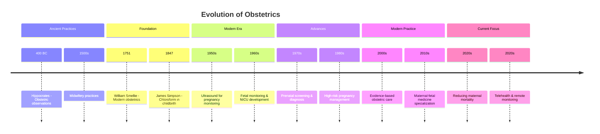

```mermaid
timeline
    title Evolution of Obstetrics
    section Ancient Practices
        400 BC : Hippocrates - Obstetric observations
        1500s : Midwifery practices
    section Foundation
        1751 : William Smellie - Modern obstetrics
        1847 : James Simpson - Chloroform in childbirth
    section Modern Era
        1950s : Ultrasound for pregnancy monitoring
        1960s : Fetal monitoring & NICU development
    section Advances
        1970s : Prenatal screening & diagnosis
        1980s : High-risk pregnancy management
    section Modern Practice
        2000s : Evidence-based obstetric care
        2010s : Maternal-fetal medicine specialization
    section Current Focus
        2020s : Reducing maternal mortality
        2020s : Telehealth & remote monitoring
```
