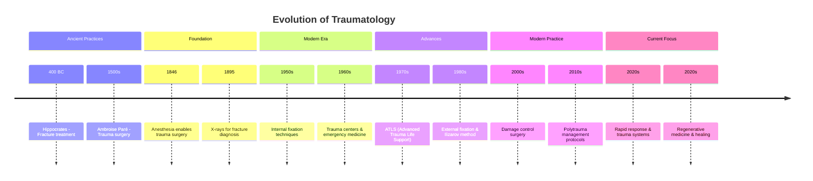

```mermaid
timeline
    title Evolution of Traumatology
    section Ancient Practices
        400 BC : Hippocrates - Fracture treatment
        1500s : Ambroise Paré - Trauma surgery
    section Foundation
        1846 : Anesthesia enables trauma surgery
        1895 : X-rays for fracture diagnosis
    section Modern Era
        1950s : Internal fixation techniques
        1960s : Trauma centers & emergency medicine
    section Advances
        1970s : ATLS (Advanced Trauma Life Support)
        1980s : External fixation & Ilizarov method
    section Modern Practice
        2000s : Damage control surgery
        2010s : Polytrauma management protocols
    section Current Focus
        2020s : Rapid response & trauma systems
        2020s : Regenerative medicine & healing
```
