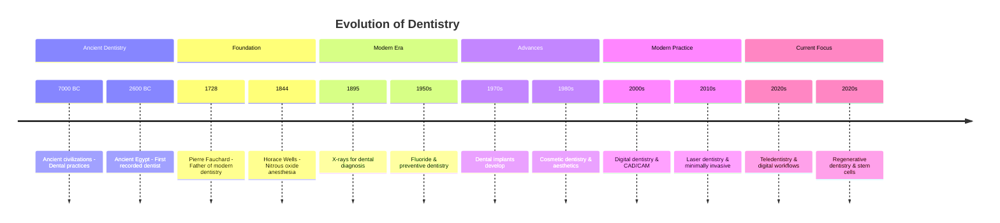

```mermaid
timeline
    title Evolution of Dentistry
    section Ancient Dentistry
        7000 BC : Ancient civilizations - Dental practices
        2600 BC : Ancient Egypt - First recorded dentist
    section Foundation
        1728 : Pierre Fauchard - Father of modern dentistry
        1844 : Horace Wells - Nitrous oxide anesthesia
    section Modern Era
        1895 : X-rays for dental diagnosis
        1950s : Fluoride & preventive dentistry
    section Advances
        1970s : Dental implants develop
        1980s : Cosmetic dentistry & aesthetics
    section Modern Practice
        2000s : Digital dentistry & CAD/CAM
        2010s : Laser dentistry & minimally invasive
    section Current Focus
        2020s : Teledentistry & digital workflows
        2020s : Regenerative dentistry & stem cells
```
