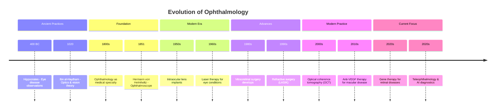

```mermaid
timeline
    title Evolution of Ophthalmology
    section Ancient Practices
        400 BC : Hippocrates - Eye disease observations
        1020 : Ibn al-Haytham - Optics & vision theory
    section Foundation
        1800s : Ophthalmology as medical specialty
        1851 : Hermann von Helmholtz - Ophthalmoscope
    section Modern Era
        1950s : Intraocular lens implants
        1960s : Laser therapy for eye conditions
    section Advances
        1980s : Vitreoretinal surgery develops
        1990s : Refractive surgery (LASIK)
    section Modern Practice
        2000s : Optical coherence tomography (OCT)
        2010s : Anti-VEGF therapy for macular disease
    section Current Focus
        2020s : Gene therapy for retinal diseases
        2020s : Teleophthalmology & AI diagnostics
```
