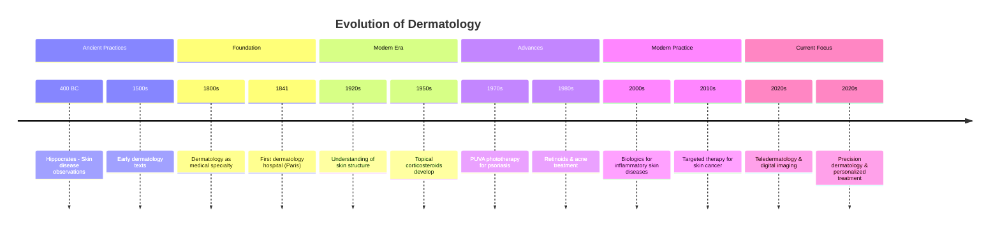

```mermaid
timeline
    title Evolution of Dermatology
    section Ancient Practices
        400 BC : Hippocrates - Skin disease observations
        1500s : Early dermatology texts
    section Foundation
        1800s : Dermatology as medical specialty
        1841 : First dermatology hospital (Paris)
    section Modern Era
        1920s : Understanding of skin structure
        1950s : Topical corticosteroids develop
    section Advances
        1970s : PUVA phototherapy for psoriasis
        1980s : Retinoids & acne treatment
    section Modern Practice
        2000s : Biologics for inflammatory skin diseases
        2010s : Targeted therapy for skin cancer
    section Current Focus
        2020s : Teledermatology & digital imaging
        2020s : Precision dermatology & personalized treatment
```
