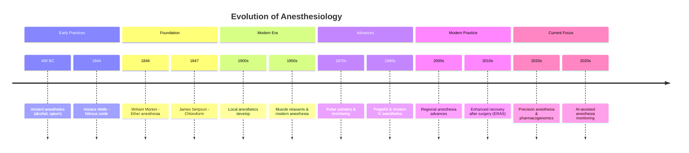

```mermaid
timeline
    title Evolution of Anesthesiology
    section Early Practices
        400 BC : Ancient anesthetics (alcohol, opium)
        1844 : Horace Wells - Nitrous oxide
    section Foundation
        1846 : William Morton - Ether anesthesia
        1847 : James Simpson - Chloroform
    section Modern Era
        1900s : Local anesthetics develop
        1950s : Muscle relaxants & modern anesthesia
    section Advances
        1970s : Pulse oximetry & monitoring
        1980s : Propofol & modern IV anesthetics
    section Modern Practice
        2000s : Regional anesthesia advances
        2010s : Enhanced recovery after surgery (ERAS)
    section Current Focus
        2020s : Precision anesthesia & pharmacogenomics
        2020s : AI-assisted anesthesia monitoring
```
