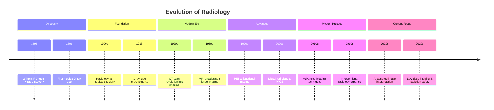

```mermaid
timeline
    title Evolution of Radiology
    section Discovery
        1895 : Wilhelm Röntgen - X-ray discovery
        1896 : First medical X-ray use
    section Foundation
        1900s : Radiology as medical specialty
        1913 : X-ray tube improvements
    section Modern Era
        1970s : CT scan revolutionizes imaging
        1980s : MRI enables soft tissue imaging
    section Advances
        1990s : PET & functional imaging
        2000s : Digital radiology & PACS
    section Modern Practice
        2010s : Advanced imaging techniques
        2010s : Interventional radiology expands
    section Current Focus
        2020s : AI-assisted image interpretation
        2020s : Low-dose imaging & radiation safety
```
