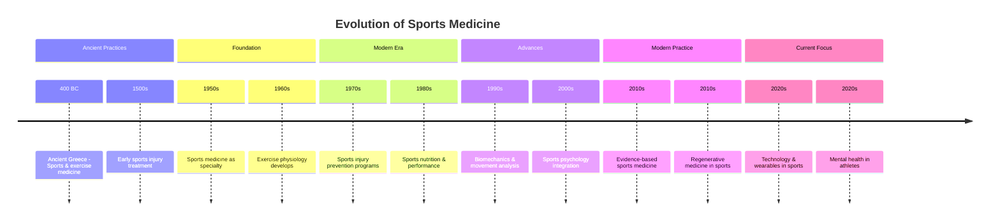

```mermaid
timeline
    title Evolution of Sports Medicine
    section Ancient Practices
        400 BC : Ancient Greece - Sports & exercise medicine
        1500s : Early sports injury treatment
    section Foundation
        1950s : Sports medicine as specialty
        1960s : Exercise physiology develops
    section Modern Era
        1970s : Sports injury prevention programs
        1980s : Sports nutrition & performance
    section Advances
        1990s : Biomechanics & movement analysis
        2000s : Sports psychology integration
    section Modern Practice
        2010s : Evidence-based sports medicine
        2010s : Regenerative medicine in sports
    section Current Focus
        2020s : Technology & wearables in sports
        2020s : Mental health in athletes
```
