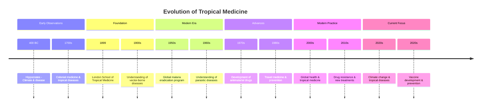

```mermaid
timeline
    title Evolution of Tropical Medicine
    section Early Observations
        400 BC : Hippocrates - Climate & disease
        1700s : Colonial medicine & tropical diseases
    section Foundation
        1899 : London School of Tropical Medicine
        1900s : Understanding of vector-borne diseases
    section Modern Era
        1950s : Global malaria eradication program
        1960s : Understanding of parasitic diseases
    section Advances
        1970s : Development of antimalarial drugs
        1980s : Travel medicine & prevention
    section Modern Practice
        2000s : Global health & tropical medicine
        2010s : Drug resistance & new treatments
    section Current Focus
        2020s : Climate change & tropical diseases
        2020s : Vaccine development & prevention
```
