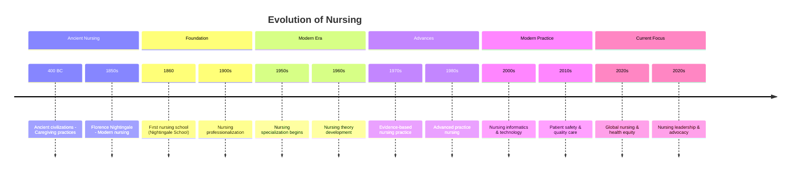

```mermaid
timeline
    title Evolution of Nursing
    section Ancient Nursing
        400 BC : Ancient civilizations - Caregiving practices
        1850s : Florence Nightingale - Modern nursing
    section Foundation
        1860 : First nursing school (Nightingale School)
        1900s : Nursing professionalization
    section Modern Era
        1950s : Nursing specialization begins
        1960s : Nursing theory development
    section Advances
        1970s : Evidence-based nursing practice
        1980s : Advanced practice nursing
    section Modern Practice
        2000s : Nursing informatics & technology
        2010s : Patient safety & quality care
    section Current Focus
        2020s : Global nursing & health equity
        2020s : Nursing leadership & advocacy
```
