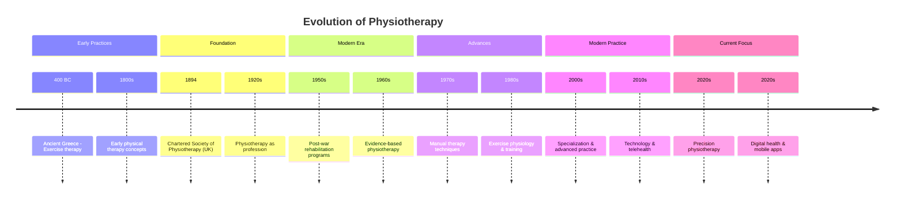

```mermaid
timeline
    title Evolution of Physiotherapy
    section Early Practices
        400 BC : Ancient Greece - Exercise therapy
        1800s : Early physical therapy concepts
    section Foundation
        1894 : Chartered Society of Physiotherapy (UK)
        1920s : Physiotherapy as profession
    section Modern Era
        1950s : Post-war rehabilitation programs
        1960s : Evidence-based physiotherapy
    section Advances
        1970s : Manual therapy techniques
        1980s : Exercise physiology & training
    section Modern Practice
        2000s : Specialization & advanced practice
        2010s : Technology & telehealth
    section Current Focus
        2020s : Precision physiotherapy
        2020s : Digital health & mobile apps
```
